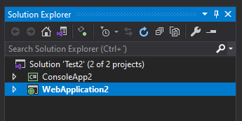
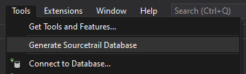

Sourcetrail DotnetIndexer Extension for Visual Studio
----

Dependencies
---
- Sourcetrail (https://github.com/CoatiSoftware/Sourcetrail)
- Sourcetrail DotnetIndexer (https://github.com/packdat/SourcetrailDotnetIndexer)

Setup
----------
1. Download and install Sourcetrail (https://github.com/CoatiSoftware/Sourcetrail/releases)
2. Download Sourcetrail DotnetIndexer (https://github.com/packdat/SourcetrailDotnetIndexer/releases)
3. Configure this extension in Visual Studio (Tools > Options > Sourcetrail DotnetIndexer)
    - Sourcetrail > Executable Path: Should point to Sourcetrail.exe
    - DotnetIndexer > Executable Path: Should point to SourcetrailDotnetIndexer.exe
    - DotnetIndexer > Search Paths: By default points to "C:\Windows\Microsoft.NET\Framework64\v4.0.30319". You should read DotnetIndexer's usage for more information.

Usage
-----
Select project to generate Sourcetrail database from (it's the blue one):

Click Tools > Generate Sourcetrail Database:

